# Grafana Installation and Dashboard Creation for Ubuntu Server Performance
## Introduction
In this lab, we set up Grafana to interface with Azure Monitor using Managed Identity for authentication. Instead of using traditional client secrets or credentials, we used Azure Managed Identity, which provides secure, automated authentication without retaining sensitive data. This method improved security while simplifying access control. We configured an Azure Monitor data source in Grafana, authenticated with Managed Identity, and ran a health check to ensure the connection. In addition, we resolved frequent difficulties such as subscription access and missing Log Analytics workspaces, guaranteeing a seamless combination of Grafana with Azure Monitor for efficient cloud monitoring.
## Screenshot of the Steps
1. VM Overview in Azure displays information about the virtual machine (VM) established for the lab, such as its status, resource group, location, and subscription.
   
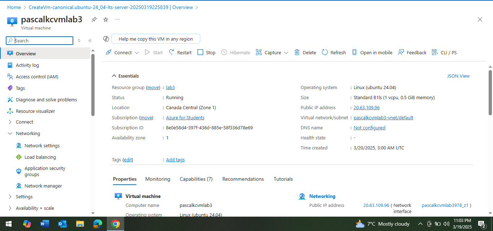
2. Starting Grafana Service and verifying that the Grafana service has been successfully activated and is operating on the virtual machine.
   

3. Grafana Login Page – Accessing the Grafana web interface through the browser using the assigned public IP and port.

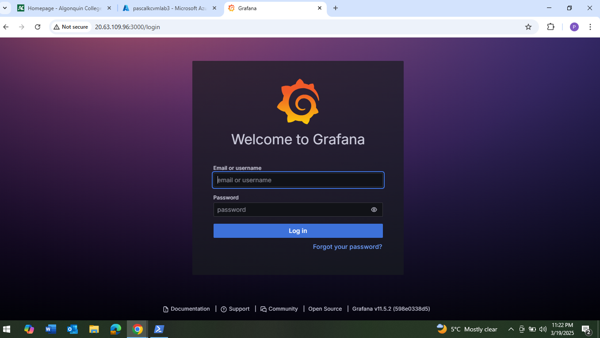
4. Updating Grafana Password – Prompted to change the default Grafana admin password for security purposes.
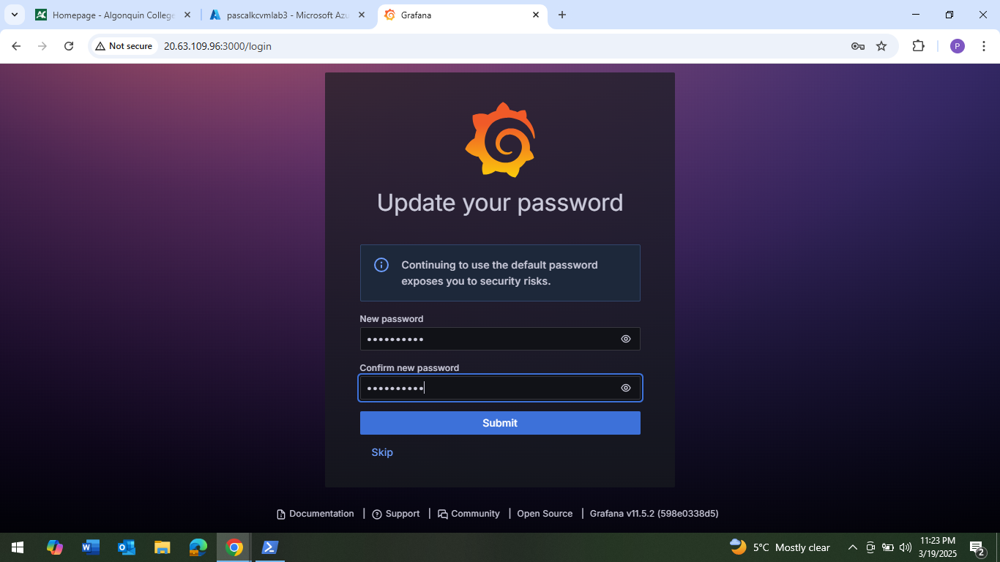

5. Enabling System-Assigned Managed Identity – Configuring the VM to use a system-assigned managed identity for secure authentication.
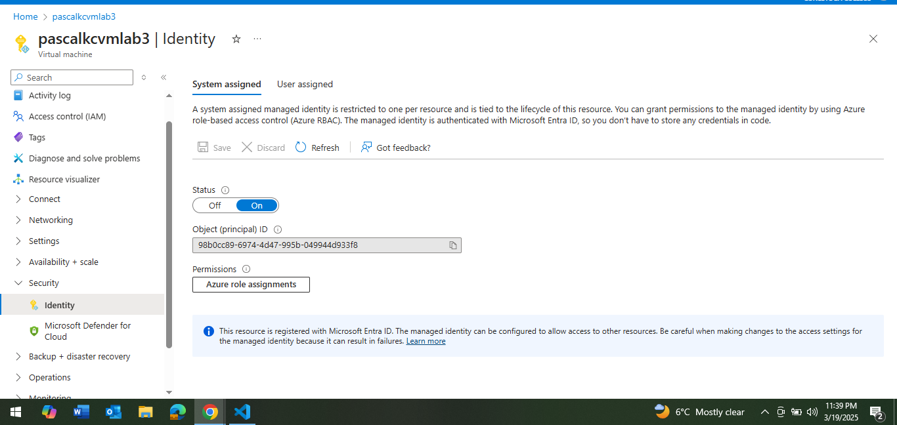

6. Assigning Monitoring Reader Role – Granting the necessary permissions to the VM for Azure Monitor integration.
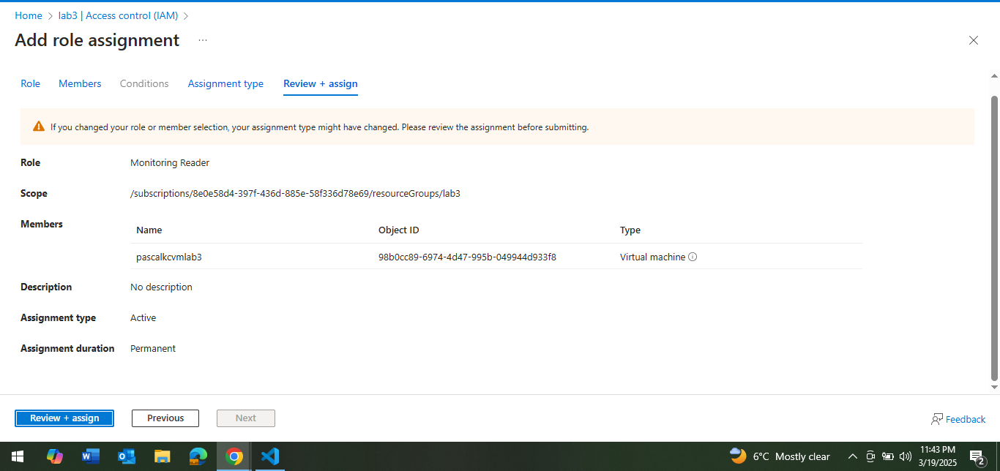

7. Assigning Reader Role at Subscription Level – Providing the VM with read access to resources within the Azure subscription.
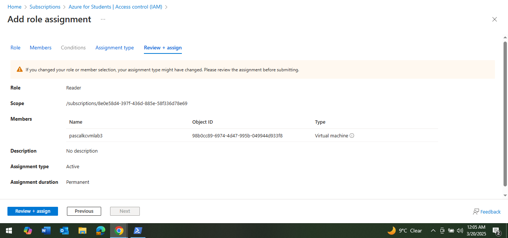

8. Reviewing Azure Role Assignments – Listing all assigned roles for the VM under the Azure for Students subscription.  

9. The managed_identity_enabled and azure_auth_enabled options are set to true, allowing integration with Azure services. 
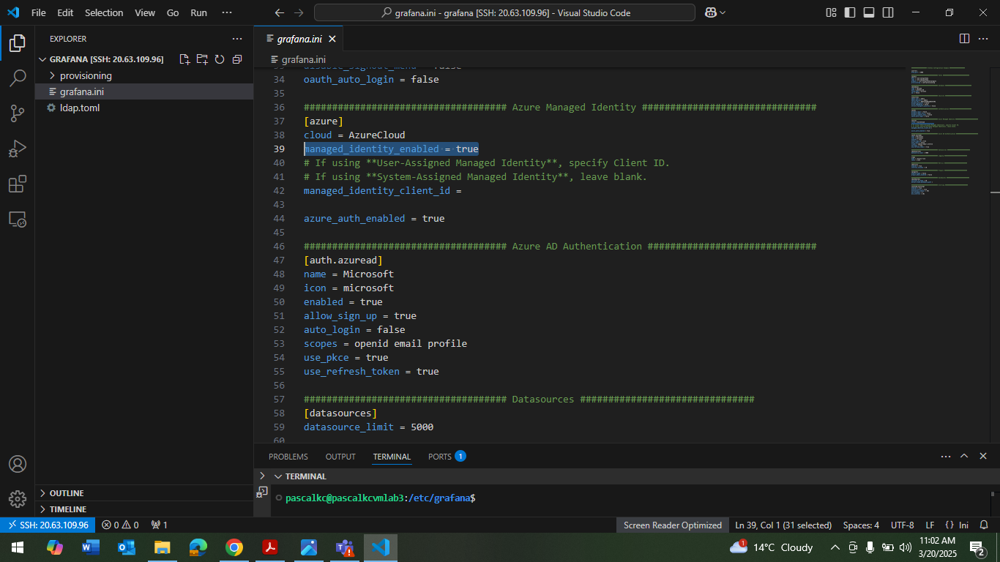

10. Configuring Azure Monitor as a Data Source in Grafana – Setting up authentication and selecting the Azure subscription for monitoring.

11. Successful Connection to Azure Monitor – Confirming that Grafana successfully connected to Azure Monitor and is ready to visualize data.
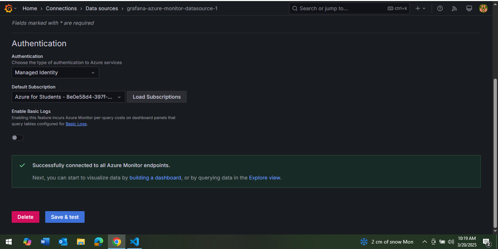

12. A pre-configured dashboard is displayed for tracking CPU, memory, and network consumption.
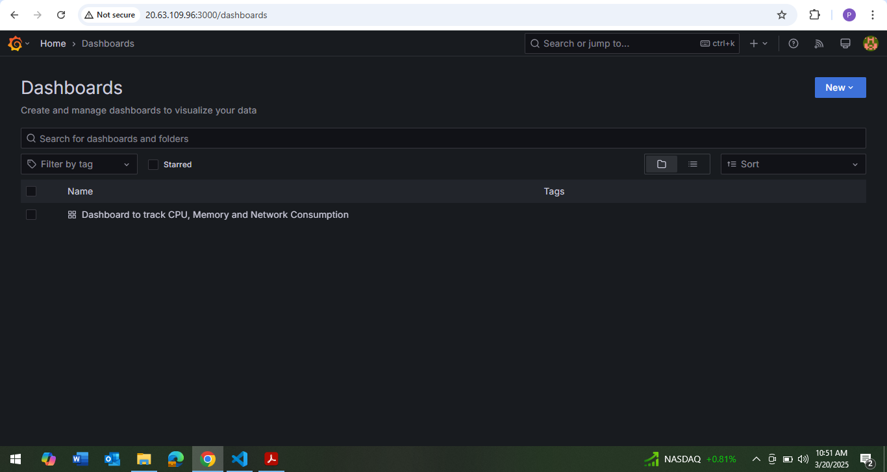
13. A detailed view of the Grafana dashboard tracking network usage over time, displaying data in megabytes.
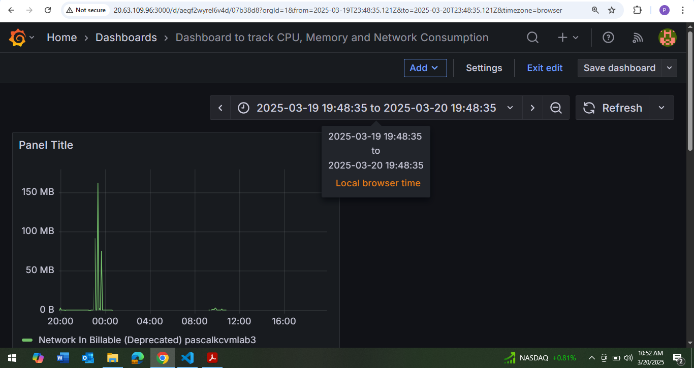
14. A real-time graph visualizing CPU credits consumption for the monitored system, helping track CPU efficiency over time.
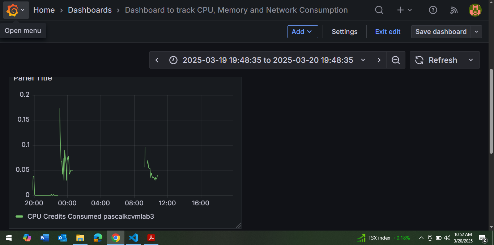
15. A visual representation of CPU usage as a percentage, showing spikes and trends over a selected time range.
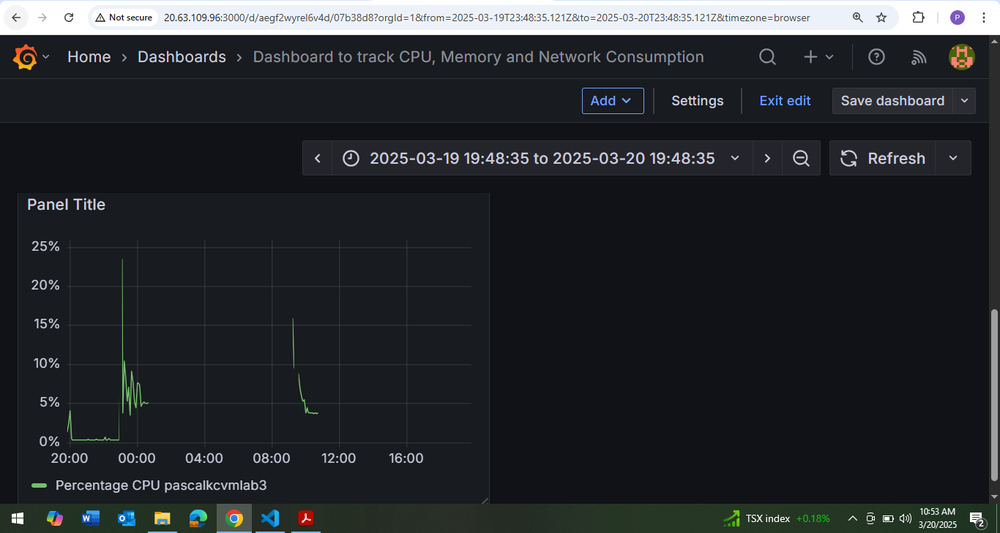

## Results
During this lab, we successfully installed and configured Grafana on an Ubuntu server, and then integrated it with Azure Monitor to visualize system performance data. However, we ran into a few problems, including permission issues while modifying the grafana.ini file, which were fixed by adjusting file permissions and utilizing sudo privileges.The Grafana service originally failed to start due to database permissions concerns, which we resolved by changing the ownership of the data directory and restarting the service.  Authentication problems in Azure Monitor were resolved by checking and assigning the appropriate Managed Identity roles, whilst the subscription loading issue was resolved by refreshing the configurations and ensuring the VM had the relevant rights.  Furthermore, the Grafana web interface was initially unreachable due to firewall constraints, which we resolved by permitting traffic on port 3000 via the firewall and Azure Network Security Groups (NSG).  Finally, to resolve the "No Log Analytics Workspaces Found" error, confirm active workspaces in Azure and ensure proper settings. We successfully resolved these issues through systematic troubleshooting, resulting in a fully functional Grafana setup that displays real-time performance insights from Azure Monitor.
## Conlusion
Finally, this lab demonstrated how to install and configure Grafana on an Ubuntu server for performance monitoring with Azure Monitor.  We successfully installed Grafana, linked it with Azure via Managed Identity, and fixed several issues with file rights, authentication, and network access.  We learned a lot about system monitoring and security configurations when troubleshooting issues including subscription loading difficulties, firewall restrictions, and missing Log Analytics workspaces.  This exercise underlined the significance of role-based access control (RBAC) in cloud systems while also demonstrating how Grafana can be used for real-time performance visualization.  Overall, the lab helped us better grasp cloud-based monitoring solutions and troubleshooting approaches that are required for effective cloud infrastructure management.

 

